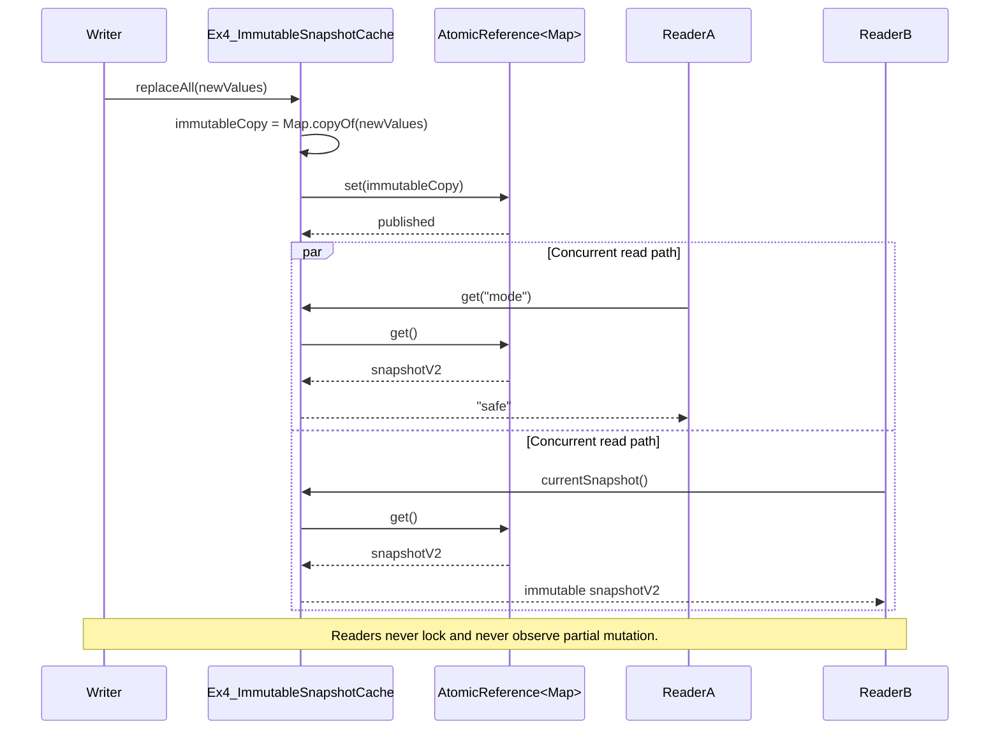

# Week 4 Sequence Diagram - Immutable Snapshot Cache

This diagram corresponds to W4.P4.Ex4 and illustrates atomic snapshot replacement with lock-free reads.

```mermaid
sequenceDiagram
    participant Writer
    participant Cache as Ex4_ImmutableSnapshotCache
    participant Ref as AtomicReference<Map>
    participant ReaderA
    participant ReaderB

    Writer->>Cache: replaceAll(newValues)
    Cache->>Cache: immutableCopy = Map.copyOf(newValues)
    Cache->>Ref: set(immutableCopy)
    Ref-->>Cache: published

    par Concurrent read path
        ReaderA->>Cache: get("mode")
        Cache->>Ref: get()
        Ref-->>Cache: snapshotV2
        Cache-->>ReaderA: "safe"
    and Concurrent read path
        ReaderB->>Cache: currentSnapshot()
        Cache->>Ref: get()
        Ref-->>Cache: snapshotV2
        Cache-->>ReaderB: immutable snapshotV2
    end

    note over Writer,ReaderB: Readers never lock and never observe partial mutation.
```
