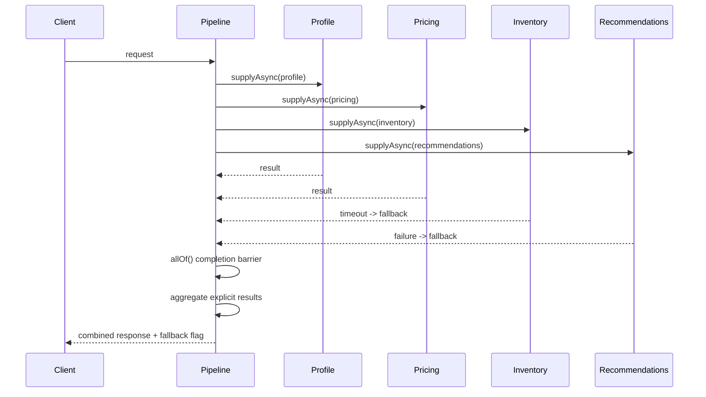

# Async Pipeline Sequence Diagram

Students should complete or adapt this diagram for the Part 4 deliverable.

## Explanation Prompts

- Which tasks fan out independently?
- What coordinates fan-in?
- Where does timeout become fallback?
- Where does failure become fallback?
- How does the response reveal that fallback was used?
